\newpage

# Introduction {.unnumbered}

<!--
Depuis plusieurs années, le numérique a profondément transformé la manière dont nous consommons et partageons nos loisirs culturels. Le cinéma dispose de Letterboxd, la musique de Last.fm : des plateformes communautaires qui permettent à chacun de garder une trace de ses découvertes, de les noter et d'échanger avec d'autres passionnés. La lecture, pourtant, reste étonnamment mal servie sur ce plan. Le principal service existant, Goodreads, appartient à Amazon, ce qui pose des questions en matière d'indépendance éditoriale et d'exploitation des données personnelles des lecteurs.

C'est de ce constat qu'est né le projet Ex-Libris : une application de suivi de lecture pensée comme un véritable réseau social pour les lecteurs. L'objectif n'est pas de reconstruire un catalogue de livres, un travail déjà accompli et maintenu par la plateforme collaborative Open Library, qui référence plusieurs millions d'ouvrages en accès libre. Ce qu'Open Library ne propose pas, en revanche, c'est la dimension humaine de la lecture : qui a lu quel livre, quand, avec quel avis, et quelles recommandations peuvent en être tirées. C'est précisément cette couche que notre application vient ajouter.

Concrètement, Ex-Libris doit permettre à un utilisateur de créer un compte, de rechercher un livre et d'en consulter la fiche détaillée, de l'ajouter à sa bibliothèque personnelle avec un statut de lecture, de le noter et d'en rédiger une critique. Au-delà de cette gestion individuelle, l'application intègre une dimension sociale : chaque utilisateur peut consulter le profil d'un autre lecteur, s'abonner à son activité, et bénéficier d'un système de recommandation construit à partir des affinités entre utilisateurs.

D'un point de vue technique, le projet repose sur une API REST développée avec FastAPI, exploitant les données de l'API publique Open Library et s'appuyant sur une base de données PostgreSQL pour la persistance des données propres à notre application. Le langage retenu est Python, dans une logique de programmation orientée objet.

Ce dossier présente dans un premier temps le cahier des charges du projet, les choix et arbitrages qui ont guidé nos réflexions, ainsi que l'organisation retenue au sein de notre équipe. Il détaille ensuite le modèle de conception élaboré pour répondre à ces besoins, à travers les différents diagrammes UML réalisés.
-->

Un ex-libris est cette marque, vignette, cachet ou tampon qu'un lecteur appose sur ses livres pour les personnaliser et y laisser une trace de son passage. À l'heure du numérique, comment conserver la mémoire de ses lectures, y imprimer sa propre marque et échanger autour d'elles ? Cette manière de s'approprier ses lectures a inspiré le nom de notre projet : Ex-Libris.

Aujourd'hui, le cinéma dispose de Letterboxd, la musique de Last.fm. Ces plateformes communautaires permettent à chacun de garder une trace de ses découvertes, de les noter et d'échanger avec d'autres passionnés. La lecture, elle, reste étonnamment mal servie sur ce plan. Le principal service existant, Goodreads, appartient à Amazon, ce qui peut soulever des interrogations quant à l'indépendance de la plateforme et à l'utilisation des données des lecteurs.

Notre objectif n'est pas de reconstruire un catalogue de livres : ce travail est déjà très bien réalisé par Open Library, plateforme collaborative qui référence plusieurs millions d'ouvrages en accès libre. En revanche, cette plateforme n'offre pas la dimension humaine et sociale de la lecture : qui a lu quel livre, quand, avec quel avis, et quelles recommandations peuvent en être tirées. Notre application s'appuie ainsi sur les données d'Open Library pour se concentrer sur ce qui manque réellement : le suivi des lectures et les interactions entre lecteurs.

Concrètement, Ex-Libris permet à un utilisateur de créer un compte, de rechercher un livre et de l'ajouter à sa bibliothèque avec un statut de lecture. Il peut ensuite le noter et rédiger une critique, laissant ainsi sa propre marque sur chaque ouvrage. À cette gestion individuelle s'ajoute une dimension sociale : consulter le profil d'autres lecteurs, suivre leur activité et bénéficier de recommandations fondées sur les affinités entre utilisateurs.
Sur le plan technique, le projet repose sur une API REST développée avec FastAPI, exploitant l'API publique d'Open Library et une base de données PostgreSQL, le tout en Python selon une approche orientée objet.

Ce dossier revient d'abord sur le cahier des charges du projet (Partie 1), qui présente le fonctionnement d'Open Library, la manière dont nous exploitons ses données et le périmètre fonctionnel retenu. Il détaille ensuite l'organisation mise en place au sein de l'équipe, entre répartition des rôles et planning de travail (Partie 2). Enfin, il présente la conception de l'application (Partie 3) à travers les différents diagrammes UML élaborés, notamment le modèle de données, le diagramme de classes et les diagrammes de séquence, qui traduisent concrètement les choix effectués.

\newpage

# Cahier des Charges

Ce cahier des charges exprime le besoin initial auquel notre application doit répondre : une application de suivi de lecture combinant la richesse du catalogue d'Open Library à une véritable dimension sociale entre lecteurs. Sur cette base, notre travail a consisté à reformuler ce besoin, à en préciser le périmètre exact, et à définir les fonctionnalités attendues ainsi que les contraintes techniques qui en découlent, notamment celles liées à l'exploitation d'une source de données externe.

## Présentation d'Open Library

\begin{flushright}
\vspace{-1.5cm}
\includegraphics[width=0.15\textwidth]{OL_logo.png}
\vspace{-0.5cm}
\end{flushright}

Notre application repose entièrement sur les données fournies par Open Library, une base collaborative et gratuite qui référence plusieurs millions d'ouvrages. Il s'agit d'une API web : on l'interroge en construisant des adresses (URLs) spécifiques, et elle nous renvoie les données demandées au format JSON. Open Library utilise trois objets majeurs: l'**auteur**, l'**œuvre** (l'idée générale du livre : titre, résumé, thèmes) et l'**édition** (une publication matérielle précise de cette œuvre — une même œuvre pouvant compter des centaines d'éditions). Le langage courant confond ces deux derniers sous le même mot « livre ».

Nous avons choisi d'utiliser l'identifiant d'œuvre (id_work) comme référence unique dans l'application. Les lectures, notes et critiques sont ainsi associées à l'œuvre et non à une édition particulière. Une évolution future pourrait toutefois permettre de consulter les différentes éditions disponibles via Open Library, grâce à des requêtes effectuées dynamiquement auprès de l'API, sans modifier le modèle de données actuel.

<!-- On ne l'aborde pas et nous n'avons pas travaillé dessus...
Nous avons par ailleurs constaté que le champ `subjects` (thèmes et genres), rédigé en texte libre, mélange genres littéraires et mots-clés isolés. Cette hétérogénéité motive notre fonctionnalité de normalisation des genres, pour une classification plus cohérente et exploitable pour la recherche.
-->


<!-- A retirer?
\begin{center}
\includegraphics[width=0.8\textwidth]{API1.png}
\end{center}
-->

<!-- Peut-être retirer ces tables
\begin{center}

\begin{minipage}{0.45\textwidth}
\centering
\includegraphics[width=\textwidth]{work.png}
\end{minipage}
\hfill
\begin{minipage}{0.45\textwidth}
\centering
\includegraphics[width=\textwidth]{edition.png}
\end{minipage}

\vspace{0.3cm}

\includegraphics[width=0.6\textwidth]{auteur.png}

\end{center}
-->


## Diagramme de cas d'utilisation


Le système Ex-Libris distingue deux acteurs : le **Visiteur**, non authentifié, et l'**Utilisateur**, qui hérite du Visiteur et accède à l'ensemble des fonctionnalités une fois connecté. Le Visiteur ne peut que créer un compte ou s'authentifier ; toutes les autres actions nécessitent d'être connecté.

Partant de nos expériences personnelles d'utilisateurs de sites de musique ou de films, nous avons réfléchi ensemble aux fonctionnalités que nous souhaitions voir figurer dans notre projet.

Le diagramme ci-dessous offre une vue d'ensemble organisée par paquetage fonctionnel. Le détail des cas d'utilisation qui composent chacun d'eux est précisé en face.

```{=latex}
\begin{minipage}{\textwidth}
\hspace{-2cm}\begin{tabular}{p{9cm}p{10cm}}
\includegraphics[width=9cm]{cas_usage}

\hspace{2cm}\textit{Diagramme des cas d'usage}
&
\vspace{-10cm}

\textbf{F1 – Gérer son compte}\smallskip

- S'authentifier

- Créer un compte

- Mettre à jour son profil (mot de passe, email, bio)\medskip

\textbf{F2 – Rechercher et consulter}\smallskip

- Rechercher un livre

- Consulter la fiche d'un livre

- Consulter son propre profil (bio, nombre d'abonnés, d'abonnements, de livres, de critiques, de likes/dislikes)\medskip

\textbf{F3 – Gérer sa bibliothèque}\smallskip

- Consulter sa bibliothèque

- Ajouter un livre à sa bibliothèque

- Mettre à jour le statut d'un livre (à lire / en cours / lu / abandonné)

- Noter un livre (de 0 à 5, si lu ou abandonné)\medskip

\textbf{F4 – Gérer les critiques}\smallskip

- Rédiger une critique (si le livre est lu ou abandonné)

- Consulter les critiques d'un livre

\textit{Note et critique relèvent volontairement de deux cas d'utilisation distincts : un lecteur peut vouloir noter un livre sans rédiger de critique, ou l'inverse.}
\end{tabular}

\textbf{F5 – Obtenir des recommandations}\smallskip

- Visualiser des recommandations personnalisées

\textit{À ce stade, la logique de recommandation n'est pas totalement arrêtée. Le principe retenu est d'afficher plusieurs sections de recommandations générées automatiquement (par exemple : « de vos auteurs favoris », « les populaires d'Ex-Libris »), combinant différents critères — dont le réseau d'abonnements de l'utilisateur (F5B)}\medskip

\textbf{FO1 – Gérer sa communauté} \textit{(optionnel)}\smallskip

- Rechercher un utilisateur

- Consulter le profil d'un autre utilisateur

- Consulter la bibliothèque d'un autre utilisateur

- S'abonner à un utilisateur\medskip

\textbf{FOX – Réagir aux critiques} \textit{(optionnel)}\smallskip

- Ajouter un like ou un dislike à une critique
\end{minipage}
```

\newpage

## Diagrammes d'activités

Les diagrammes d’activités suivants présentent l’enchaînement des actions que les utilisateurs peuvent effectuer et les différentes façons de naviguer sur le site. Il permet de visualiser les choix possibles à chaque étape.

Un diagramme général correspond à l'arrivée sur la page d'accueil du site et le choix des principales fonctionnalités. Les grandes fonctionnalités sont détaillées dans les diagrammes suivants.

```{=latex}
\begin{minipage}{\textwidth}
\center
\includegraphics[width=18cm]{diagramme_activite_principal}

\textit{Diagramme d'activité: parcours utilisateur global}
\end{minipage}
```

<!-- 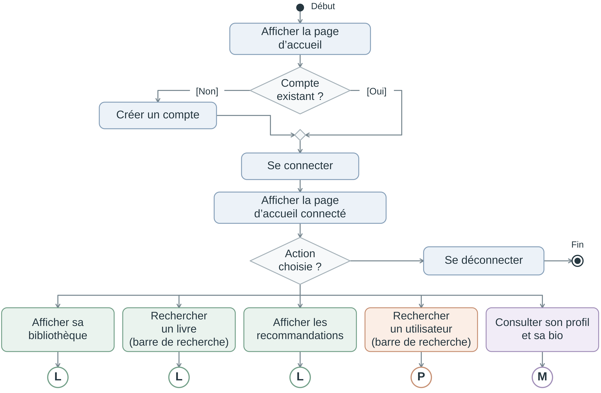{#fig-activite_principal width="80%" height="30%"} -->

\newpage


```{=latex}
\begin{minipage}{\textwidth}

\vspace{-1cm}

\center 
\hspace{-1cm}\includegraphics[width=10cm]{diagramme_activite_profil_perso}

\textit{Diagramme d'activité : gestion du profil personnel}

\vspace{1cm}

\includegraphics[width=10cm]{diagramme_activite_livre}

\textit{Diagramme d'activité : consultation d'un livre}
\end{minipage}
```


<!-- 
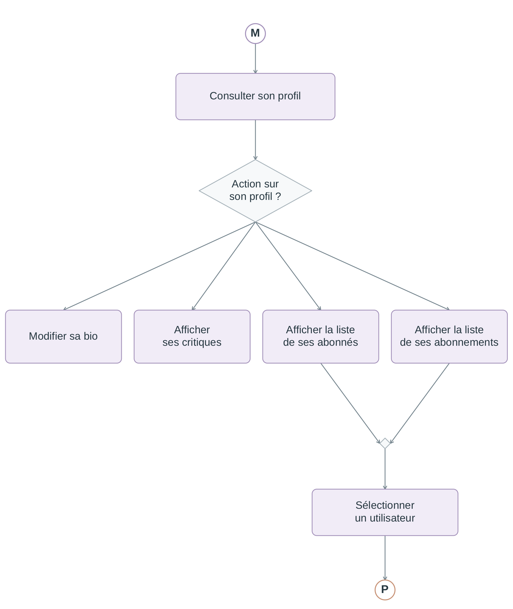{#fig-activite_profil_perso width="50%"}

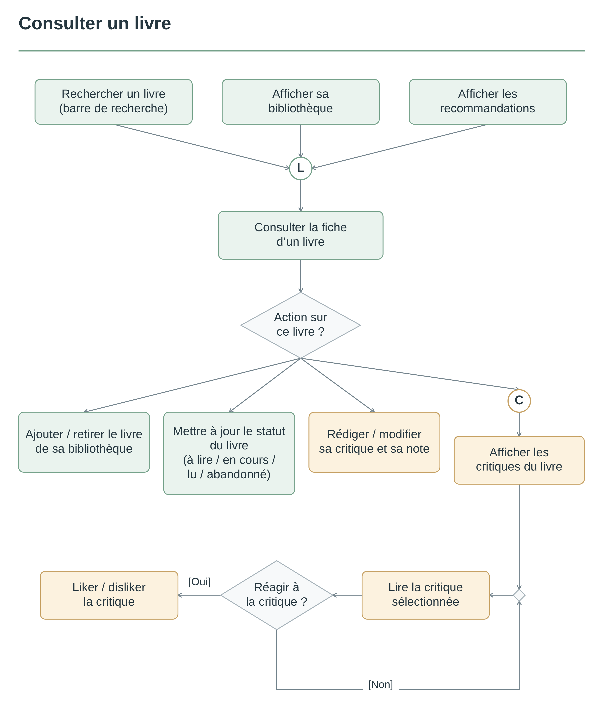{#fig-activite_livre width="50%"} -->

<!-- 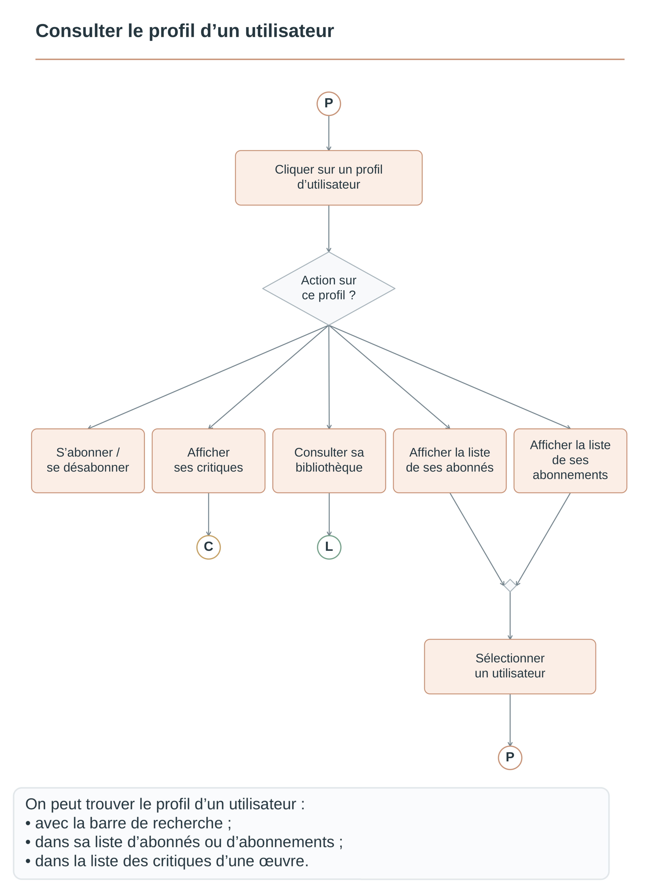{#fig-activite_login width="50%"} -->

\newpage

# Organisation du projet

## Organisation du groupe

Dès le début du projet, nous avons désigné Anne-Camille Tampet comme leader techinque et Cécile Locatelli comme cheffe de projet, en veillant, conformément aux conseils donnés en début de projet à ne pas cumuler ces deux rôles sur une même personne.

Pour communiquer, nous avons créé un groupe sur Teams, sur lequel chacun peut partager ses avancées, poser une question ou signaler un point de blocage dès que le besoin s’en fait sentir. C’est notre principal canal d’échange, sur lequel nous discutons régulièrement. En parallèle, nous avons mis en place un dépôt partagé sur GitHub, accessible à tous les membres du groupe, qui nous sert à centraliser et à distribuer l’ensemble des fichiers importants du projet.

Concernant la répartition du travail, notre organisation a surtout été pensée pour cette première phase d’analyse. Chaque membre du groupe s’est vu confier la réalisation d’un diagramme ou d’une partie spécifique du dossier, de façon à ce que chacun puisse s’investir concrètement dans la réflexion et la conception du projet. Cette répartition individuelle ne nous a cependant pas empêchés de travailler de façon très collective. Nous avons pris l’habitude de nous retrouver au minimum deux fois par semaine pour faire le point ensemble. Ces moments nous permettaient de relire et de discuter les diagrammes réalisés par chacun, de nous assurer que tout le monde comprenait bien les choix faits par les autres et de les faire évoluer si nécessaire. Cette phase de discussion collective a été particulièrement importante en tout début de projet. Elle nous a permis de poser une base commune solide et de nous assurer que tout le monde partageait la même vision de l’application avant d’avancer plus en détail sur la partie codage.
<!-- Utile??
\begin{center}
\includegraphics[width=0.62\textwidth]{git.png}

Figure 11 – Dépot Github
\end{center}
-->

## Diagramme de Gantt

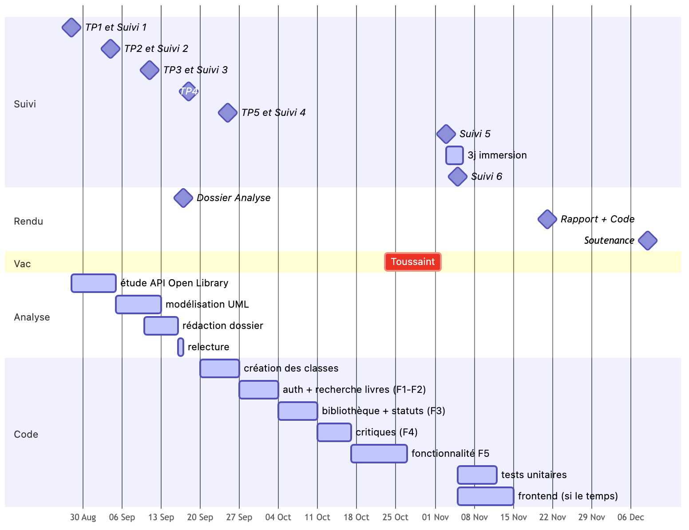{#fig-gantt width="80%l"}

<!--
\begin{center}
\includegraphics[width=0.8\textwidth]{Gantt.png}

Figure 11 – Diagramme de Gantt
\end{center}
-->

Notre planning se découpe en deux grandes phases. D'abord la phase d'analyse, de fin août à fin septembre : nous commençons par étudier l'API Open Library, puis nous réalisons l'ensemble de la modélisation UML afin de bien comprendre comment notre application va s'articuler et comment la construire.

Une fois cette base posée, nous passons à la phase de code, d'octobre à début novembre. Nous avons choisi de développer les fonctionnalités par ordre de difficulté croissante : d'abord les classes de base, puis l'authentification et la recherche de livres (F1-F2), la bibliothèque avec les statuts de lecture (F3), les critiques (F4), et enfin notre fonctionnalité F5 (les recommandations), qui nécessitera davantage de temps du fait de sa complexité. Les tests unitaires et le frontend interviendront en dernier, le frontend n'étant pas prioritaire, sera développé uniquement s'il nous reste du temps.


# Maquette de l'application

Après avoir défini les besoins et les fonctionnalités attendues, place à la conception technique de notre application. Nous détaillons ici l'organisation de la base de données, la structure en couche des classes de l'application (controller, service, dao), ainsi que le fonctionnement de quelques échanges clés entre les différents composants du système.

## Modèle des données

La conception de la base de données repose sur la séparation entre les informations bibliographiques des livres et les données propres aux utilisateurs de l'application. Les informations générales concernant les livres sont récupérées à partir de l'API Open Library : il n'est donc pas nécessaire de reconstruire localement un catalogue complet. La base de données est principalement destinée à conserver les utilisateurs ainsi que leurs interactions avec les livres (lectures, critiques, appréciations) et les relations entre utilisateurs à travers le système d'abonnement.
 
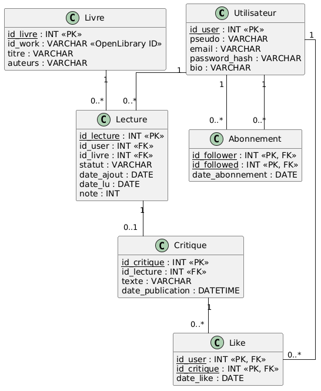{#fig-BDD width="50%"}
 
La base est composée de six tables : Utilisateur, Livre, Lecture, Critique, Abonnement et Like.
 
**Table Utilisateur**
 
Cette table constitue l'entité centrale de la base. Contrairement aux données bibliographiques issues d'Open Library, les utilisateurs et leurs interactions (lectures, critiques, abonnements) sont propres à Ex-Libris et doivent être conservés localement.
 
**Table Livre**
 
L'attribut `id_work` correspond à l'identifiant de l'œuvre fourni par Open Library et permet d'établir le lien avec les informations bibliographiques de l'API.
 
Bien que `id_work` permette déjà d'identifier une œuvre dans Open Library, nous avons choisi de définir notre propre clé primaire `id_livre`. Cela permet à notre base de disposer d'un identifiant interne indépendant de l'API externe : `id_work` sert alors de référence vers Open Library, tandis que `id_livre` constitue la référence interne utilisée par les autres tables, notamment `Lecture`. Nous conservons par ailleurs localement `titre` et `auteurs`, afin de les consulter sans requête systématique à Open Library, et de limiter le nombre d'appels à l'API (qui impose une limitation du nombre de requêtes par seconde).
 
**Table Lecture**
 
Cette table matérialise la relation plusieurs-à-plusieurs entre `Utilisateur` et `Livre`, en portant les informations propres à chaque interaction (statut de lecture, dates, note). C'est également elle qui centralise `note` : celle-ci n'a pas besoin d'une table dédiée, il s'agit d'un simple attribut de `Lecture`.
 
**Table Critique**  
 
Une critique est rattachée à une `Lecture` plutôt qu'à un livre ou un utilisateur directement : ce choix évite qu'un utilisateur puisse rédiger une critique pour un livre qu'il n'a pas lu ou abandonné, et permet de retrouver facilement l'utilisateur et le livre concernés via la lecture associée.
 
Table Like
La table `Like` matérialise à son tour une relation plusieurs-à-plusieurs, mais entre utilisateurs et critiques : elle enregistre l'appréciation (j'aime / je n'aime pas) qu'un utilisateur porte sur une critique.
 
**Table Abonnement**
 
Cette table met en relation deux instances de la même entité `Utilisateur` selon deux rôles différents (`follower` / `followed`), pour représenter le système d'abonnement entre utilisateurs.

## Diagramme de classes

### Classes Business Object

Certaines classes contiennent les attributs des objets qui sont utilisés pour les méthodes présentes dans les classes DAO et Services. Ces classes définissent les business object qui sont les objets manipulés pour construire l'application.

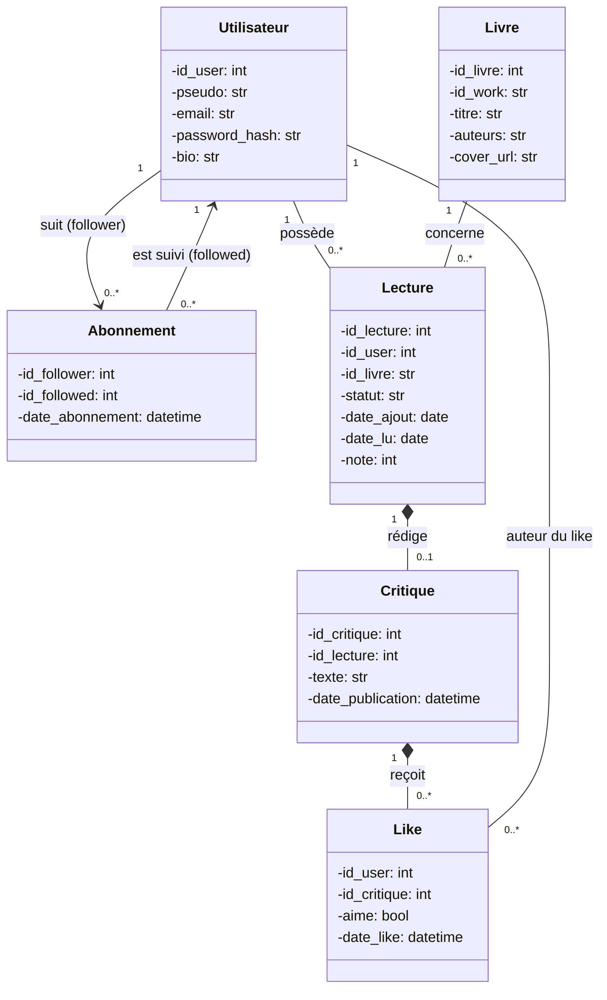{#fig-business_object width="50%"}

<!--
\begin{center}
\includegraphics[width=0.5\textwidth]{classe_1.png}

Figure 11 – Diagramme de classes :  Business Object
\end{center}
-->

Chaque classe de ce diagramme correspond à une entité identifiée dans notre modèle de données (BDD) : `Utilisateur`, `Livre`, `Lecture`, `Critique`, `Abonnement`, `Like`. Ce sont des classes qui ne contiennent que des attributs, aucune méthode métier. Ce choix découle directement de l'architecture en couches imposée par le projet (`controller → service → dao`) : un business object représente une donnée et non un traitement. La logique (vérifications, calculs, orchestration) est déléguée aux services, ce qui évite de mélanger « ce que sont les données » et « ce qu'on en fait ».

La classe `Livre` stocke les attributs récupérés sur le plateforme OpenLibrary et qui sont nécessaires en même temps et ne peuvent pas être disponibles dans un temps limité à cause de la limite de trois requêtes par seconde qui est donnée par OpenLibrary. On envisage également de récupérer aussi l'url de la couverture du livre qui sera stockée en tant qu'url ou d'image en fonction de l'accessibilité du fichier, dans la mesure du possible.

La classe `Lecture` permet de mettre un livre dans sa bibliothèque, de lui ajouter un statut (à lire, en cours, lu, abandonné). `date_ajout` correspondra à la date de création de l'objet `Lecture`. La date `date_lu` sera la date à laquelle le statut est passé à "lu".

La classe `Utilisateur` contient les attributs liés à l'authentification des utilisateurs : l'application donne à chaque utilisateur un id unique. L'utilisateur renseigne son pseudo, son email (respect du format xxx\@xx.xx), sa bio et son mot de passe en format hashable.

Un utilisateur peut avoir plusieurs `Lecture`, mais chaque `Lecture` a un seul utilisateur.

Les utilisateurs peuvent s'abonner les uns aux autres. Cette information est renseignée dans la classe `Abonnement` qui à chaque `id_abonnement` associe un utilisateur qui s'abonne (follower) et un utilisateur à qui on s'abonne (followed). Nous avons besoin de l'`id_abonnement` car un abonnement n'est pas forcément réciproque. L'abonnement permet d'avoir sur son fil d'actualité les nouvelles lectures des utilisateurs auxquels on s'est abonné.

La classe `Critique` recense les critiques proposées par les utilisateurs pour une lecture (un livre qu'ils ont lu ou abandonné). La date de publication doit être postérieur à la date de début de lecture de la classe "Lecture". Un utilisateur peut rédiger plusieurs critiques et un livre peut recevoir plusieurs critiques. Une critique ne porte que sur une lecture.

Quand un utilisateur (`id_user`) consulte une critique, il peut mettre un ' j'aime ' ou ' je n'aime pas ' à cette critique (`id_critique`). Ces informations sont des attributs de la classe `Like`.

### Diagramme de classe pour l'authentification

Pour s'authentifier, l'utilisateur va renseigner des informations qui correspondent à l'objet de la classe `Utilisateur`.

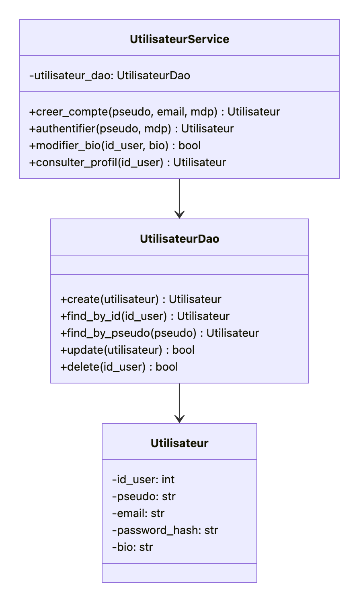{#fig-classe_2 width="40%"}

<!--
\begin{center}
\includegraphics[width=0.4\textwidth]{classe_2.png}

Figure 11 – Diagramme de classes :  authentification
\end{center}
-->
La classe "UtilisateurDAO" permet de créer, de trouver, de modifier ou de supprimer un objet de la classe "Utilisateur". Cette classe est en lien avec les données stockées en local dans la BDD car ces informations ne relèvent pas de OpenLibrary. La méthode update permet de modifier toutes les informations d'un utilisateur.

La classe "UtilisateurService" répond aux besoins métiers de l'application : les méthodes créer un compte, s'authentifier et consulter un profil renvoient l'objet Utilisateur et la méthode modifier_bio renvoie un booléen (False si l'utilisateur n'existe pas ou si la sauvegarde en base échoue).

### Diagramme de classe pour les critiques

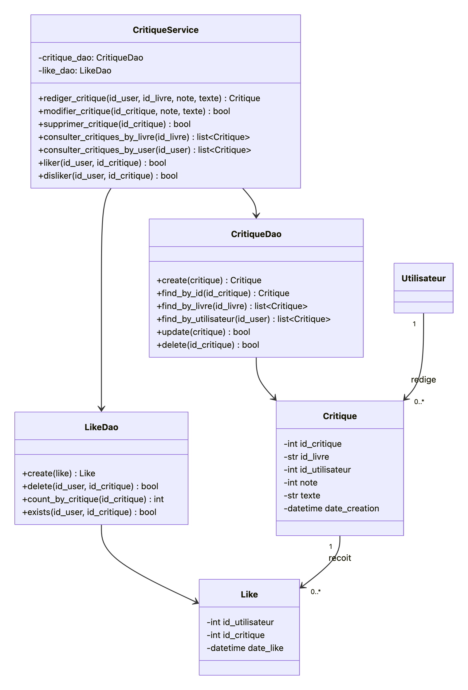{#fig-classe_3 width="50%"}

<!--
\begin{center}
\includegraphics[width=0.5\textwidth]{classe_3.png}

Figure 11 – Diagramme de classes :  critique
\end{center}
-->
La classe "CritiqueDao" permet de faire le lien entre les objets de la classe "Critique" en mémoire et la table critique dans la base de données. La méthode ' create ' permet de créer une nouvelle critique dans la base, ' find_by_id' permet de récupérer une critiaue précise, ' find_by_livre ' permet de récupérer toutes les critiques d'un livre (toutes éditions confondues), ' update ' réécrit une critique existante (possibilité seulement pour l'utilisateur qui l'a écrite), et ' delate ' supprime la critique et tous ses likes avec.

La classe "LikeDao" est l'équivalent de "CritiqueDao" mais pour la table like de la base de données. 'create' insère un nouveau like dans la base de données. 'delate' supprime un like précis (méthode appelée aussi quand un utilisateur passe du like au dislike ou vice versa). 'cont_by_critique' compte le nombre le like par critique. 'exists' vérifie si un utilisateur a déjà liké ou disliké une critique.

La classe "CritiqueService" combine les données alors que "CritiqueDao" exécute seulement des requêtes. Elle s'appuie sur " CritiqueDao" et "LikeDao" pour proposer les fonctionnalités attendues dans l'application. ' Rediger_critique ' fait appel à CritiqueDao.create en vérifiant les contraintes métier (note entre 1 et 5). ' Modifier_critique ' et ' supprimer_critique ' vérifient aussi que l'action soit exécutée par l'utilisateur qui les a rédigées. 'Consulter_critique' fait appel à 'CritiqueDao.find_by_livre et à 'LikeDao.count_by_critique' pour renvoyer les critiques accompagnées du nombre de likes qui leur sont attribués. Enfin, les méthode 'like' et 'dislike' vérifient si il existe déjà un like ou un dislike avec 'LikeDao.exist' pour éviter les doublons (liker plusieurs fois ou liker et disliker).

\newpage

## Diagrammes de séquence

Les diagrammes de séquence suivants permettent de détailler la chronologie des échanges entre les différents composants de notre architecture (Utilisateur, Contrôleur, Service, DAO, API externe) pour deux fonctionnalités de l'application : la sélection d'un livre et la demande de recommandations personnalisées.

### Sélectionner un livre

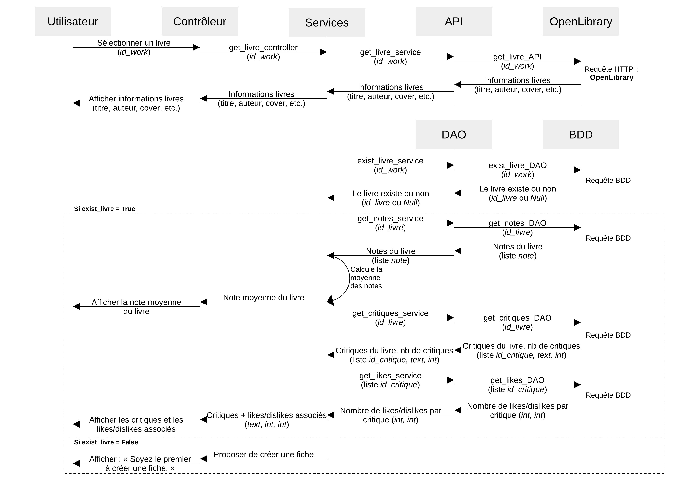{#fig-seq_select width="90%"}

<!--
\begin{center}
\includegraphics[width=0.9\textwidth]{Diagramme_Séquence_Sélectionner-livre_page-0001.jpg}

Figure 11 – Diagramme de séquence : sélectionner un livre
\end{center}
-->
Le but de cette séquence est d’afficher toutes les informations disponibles sur un livre sélectionné par un utilisateur.

Celui-ci a par exemple effectué une recherche, a obtenu une liste de livres (correspondant à une liste de `id_work`, les identifiants stockés par Open Library), il choisit l’un d’entre eux pour en afficher toutes les informations.

Cette séquence met en évidence la combinaison de deux sources d'information : les données bibliographiques fournies par Open Library (titre, auteur, couverture, etc.) et les données communautaires propres à Ex-Libris (notes, critiques et réactions des utilisateurs).

Lorsqu'un livre est déjà référencé dans Ex-Libris, l'application enrichit les informations récupérées auprès d'Open Library avec les éléments produits par la communauté, tels que la note moyenne et les critiques associées. Dans le cas contraire, l'utilisateur est invité à être le premier à enregistrer ce livre.

Le diagramme met également en évidence un choix important de conception : la consultation d'un ouvrage n'entraîne pas son enregistrement dans la base locale. Un livre n'est ajouté à Ex-Libris qu'à partir du moment où un utilisateur l'enregistre dans sa bibliothèque personnelle.

### Demander des recommandations

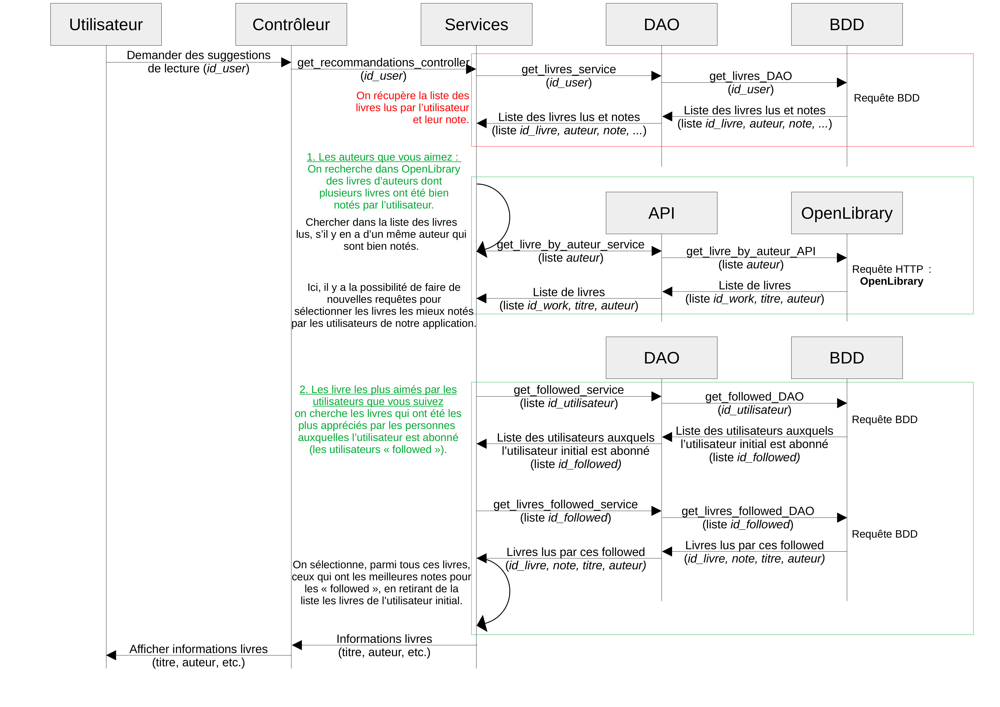{#fig-seq_reco width="90%"}

<!--
\begin{center}
\includegraphics[width=0.9\textwidth]{Diagramme_Séquence_demander-des-recommandations_page-0001.jpg}

Figure 11 – Diagramme de séquence : sélectionner un livre
\end{center}
-->
Le but de cette séquence est de recommander à l’utilisateur des livres qu’il n’a pas enregistrés et qui seraient susceptibles de lui plaire.

Il se situe sur sa page d’accueil, et clique sur un bouton « Recommandations personnelles ».

Cette séquence illustre le fonctionnement général du système de recommandation. Celui-ci repose sur l'historique de lecture et les notes attribuées par l'utilisateur afin de lui proposer des ouvrages qu'il n'a pas encore enregistrés dans sa bibliothèque, mais susceptibles de l'intéresser.
 
À ce stade du projet, l'algorithme de recommandation n'est pas totalement arrêté. Nous avons néanmoins identifié plusieurs pistes de travail.
 
__Les auteurs que vous aimez :__
 
Une première approche consiste à identifier les auteurs dont les ouvrages sont régulièrement bien notés par l'utilisateur, puis à proposer d'autres livres du même auteur à partir des données d'Open Library. Ces résultats pourraient être enrichis par les évaluations de la communauté Ex-Libris.
 
__Les recommandations du réseau :__
 
Une seconde approche s'appuie sur les abonnements. L'application peut analyser les lectures et les notes des utilisateurs suivis afin de suggérer les ouvrages les plus appréciés par ce réseau.
 
__Pistes complémentaires :__
 
D'autres stratégies sont envisagées, notamment la mise en avant des livres les mieux évalués ou les plus discutés sur la plateforme, ainsi que l'identification d'utilisateurs partageant des goûts de lecture similaires.
 
Ces différentes approches nécessitent toutefois des calculs potentiellement coûteux. Nous réfléchissons donc aux optimisations possibles, comme la conservation d'indicateurs agrégés (par exemple une note moyenne par livre) afin de limiter la charge des requêtes.
