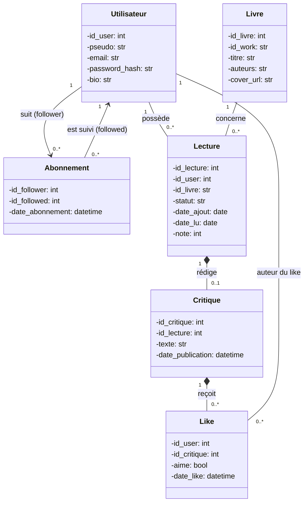
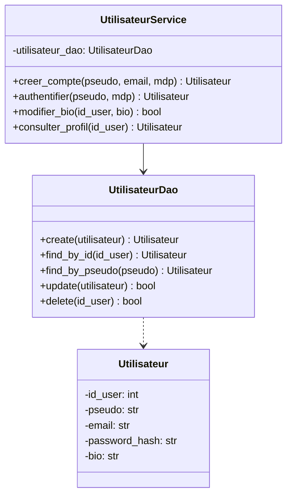
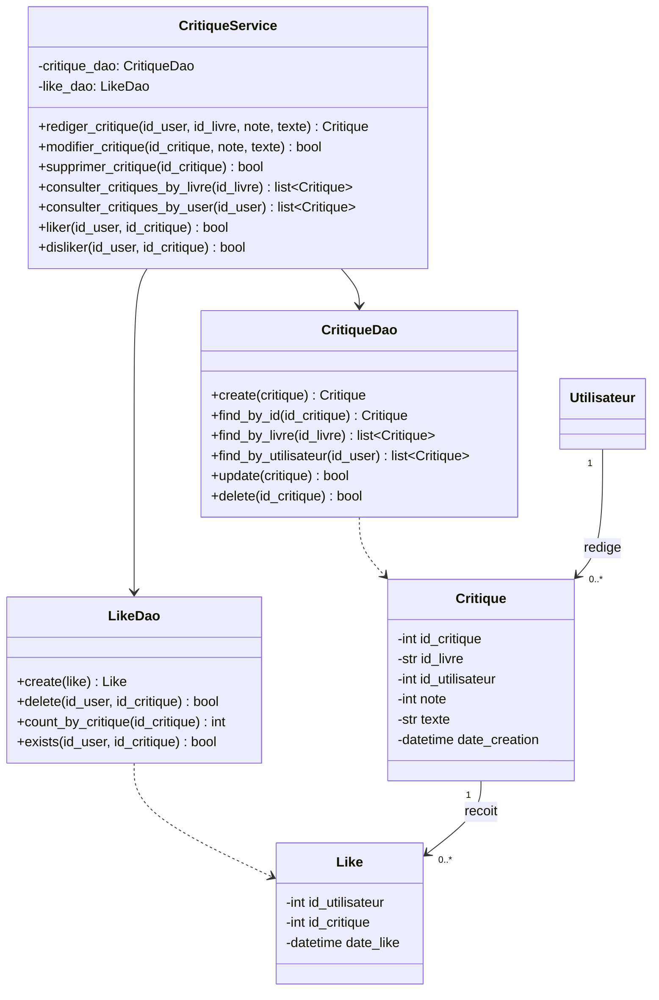

# Diagramme de classe des business object

Certaines classes contiennent les attributs des objets qui sont utilisés pour les méthodes présentes dans les classes DAO et Services. Ces classes définissent les business object qui sont les objets manipulés pour construire l'application.

Chaque classe de ce diagramme correspond à une entité identifiée dans notre modèle de données (BDD) : `Utilisateur`, `Livre`, `Lecture`, `Critique`, `Abonnement`, `Like`. Ce sont des classes qui ne contiennent que des attributs, aucune méthode métier. Ce choix découle directement de l'architecture en couches imposée par le projet (`controller → service → dao`) : un business object représente une donnée et non un traitement. La logique (vérifications, calculs, orchestration) est déléguée aux services, ce qui évite de mélanger « ce que sont les données » et « ce qu'on en fait ».

La classe `Livre` stocke les attributs récupérés sur le plateforme OpenLibrary et qui sont nécessaires en même temps et ne peuvent pas être disponibles dans un temps limité à cause de la limite de trois requêtes par seconde qui est donnée par OpenLibrary.
On envisage également de récupérer aussi l'url de la couverture du livre qui sera stockée en tant qu'url ou d'image en fonction de l'accessibilité du fichier, dans la mesure du possible.

La classe `Lecture` permet de mettre un livre dans sa bibliothèque, de lui ajouter un statut (à lire, en cours, lu, abandonné). `date_ajout` correspondra à la date de création de l'objet `Lecture`. La date `date_lu` sera la date à laquelle le statut est passé à "lu".

La classe `Utilisateur` contient les attributs liés à l'authentification des utilisateurs : l'application donne à chaque utilisateur un id unique. L'utilisateur renseigne son pseudo, son email (respect du format xxx@xx.xx), sa bio et son mot de passe en format hashable.

Un utilisateur peut avoir plusieurs `Lecture`, mais chaque `Lecture` a un seul utilisateur. 

Les utilisateurs peuvent s'abonner les uns aux autres. Cette information est renseignée dans la classe `Abonnement` qui à chaque `id_abonnement` associe un utilisateur qui s'abonne (follower) et un utilisateur à qui on s'abonne (followed). Nous avons besoin de l'`id_abonnement` car un abonnement n'est pas forcément réciproque. L'abonnement permet d'avoir sur son fil d'actualité les nouvelles lectures des utilisateurs auxquels on s'est abonné.

La classe `Critique` recense les critiques proposées par les utilisateurs pour une lecture (un livre qu'ils ont lu ou abandonné). La date de publication doit être postérieur à la date de début de lecture de la classe "Lecture". Un utilisateur peut rédiger plusieurs critiques et un livre peut recevoir plusieurs critiques. Une critique ne porte que sur une lecture.

Quand un utilisateur (`id_user`) consulte une critique, il peut mettre un ' j'aime ' ou  ' je n'aime pas ' à cette critique (`id_critique`). Ces informations sont des attributs de la classe `Like`.

# Diagramme de classe pour l'authentification

Pour s'authentifier, l'utilisateur va renseigner des informations qui correspondent à l'objet de la classe `Utilisateur`.

La classe "UtilisateurDAO" permet de créer, de trouver, de modifier ou de supprimer un objet de la classe "Utilisateur". Cette classe est en lien avec les données stockées en local dans la BDD car ces informations ne relèvent pas de OpenLibrary. La méthode update permet de modifier toutes les informations d'un utilisateur.
La classe "UtilisateurService" répond aux besoins métiers de l'application : les méthodes créer un compte, s'authentifier et consulter un profil renvoient l'objet Utilisateur et la méthode modifier_bio renvoie un booléen (False si l'utilisateur n'existe pas ou si la sauvegarde en base échoue).

# Diagramme de classe pour les critiques

La classe "CritiqueDao" permet de faire le lien entre les objets de la classe "Critique" en mémoire et la table critique dans la base de données. La méthode ' create ' permet de créer une nouvelle critique dans la base, ' find_by_id' permet de récupérer une critiaue précise, ' find_by_livre ' permet de récupérer toutes les critiques d'un livre (toutes éditions confondues), ' update ' réécrit une critique existante (possibilité seulement pour l'utilisateur qui l'a écrite), et ' delate ' supprime la critique et tous ses likes avec.

La classe "LikeDao" est l'équivalent de "CritiqueDao" mais pour la table like de la base de données. 'create' insère un nouveau like dans la base de données. 'delate' supprime un like précis (méthode appelée aussi quand un utilisateur passe du like au dislike ou vice versa). 'cont_by_critique' compte le nombre le like par critique. 'exists' vérifie si un utilisateur a déjà liké ou disliké une critique.

La classe "CritiqueService" combine les données alors que "CritiqueDao" exécute seulement des requêtes. Elle s'appuie sur " CritiqueDao" et "LikeDao" pour proposer les fonctionnalités attendues dans l'application. ' Rediger_critique ' fait appel à CritiqueDao.create en vérifiant les contraintes métier (note entre 1 et 5). ' Modifier_critique ' et ' supprimer_critique ' vérifient aussi que l'action soit exécutée par l'utilisateur qui les a rédigées. 'Consulter_critique' fait appel à 'CritiqueDao.find_by_livre et à 'LikeDao.count_by_critique' pour renvoyer les critiques accompagnées du nombre de likes qui leur sont attribués. Enfin, les méthode 'like' et 'dislike' vérifient si il existe déjà un like ou un dislike avec 'LikeDao.exist' pour éviter les doublons (liker plusieurs fois ou liker et disliker).

